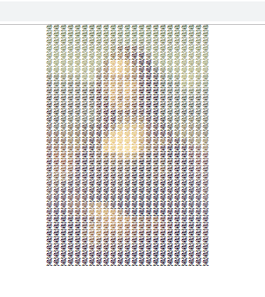

# img2html: Convert a image to HTML  [![Version][version-badge]][version-link] ![WTFPL License][license-badge]


`img2html` 用于将图片转化为 HTML 页面，并没有什么实际作用，只是为了好玩。

```
                                 ___      __          __                    ___
 __                            /'___`\   /\ \        /\ \__                /\_ \
/\_\     ___ ___       __     /\_\ /\ \  \ \ \___    \ \ ,_\    ___ ___    \//\ \
\/\ \  /' __` __`\   /'_ `\   \/_/// /__  \ \  _ `\   \ \ \/  /' __` __`\    \ \ \
 \ \ \ /\ \/\ \/\ \ /\ \L\ \     // /_\ \  \ \ \ \ \   \ \ \_ /\ \/\ \/\ \    \_\ \_
  \ \_\\ \_\ \_\ \_\\ \____ \   /\______/   \ \_\ \_\   \ \__\\ \_\ \_\ \_\   /\____\
   \/_/ \/_/\/_/\/_/ \/___L\ \  \/_____/     \/_/\/_/    \/__/ \/_/\/_/\/_/   \/____/
                       /\____/
                       \_/__/
```

原作者  [xlzd](https://github.com/xlzd)，这个fork版本支持Python3


原始图片


转化成网页的效果，直接看[链接地址](./demo/mnls.html)，你能看到网页的源代码




### 使用方式
---

#### 命令行
```
usage: img2html [-h] [-b #RRGGBB] [-s 4~30] [-c CHAR] [-t TITLE] [-f FONT] -i
                IN [-o OUT]

img2html : Convert image to HTML

optional arguments:
  -b #RRGGBB, --background #RRGGBB  background color (#RRGGBB format)
  -s (4~30), --size (4~30)          font size (int)
  -c CHAR, --char CHAR              characters
  -t TITLE, --title TITLE           html title
  -f FONT, --font FONT              html font
  -i IN, --in IN                    image to convert
  -o OUT, --out OUT                 output file


例如

img2html -i mnls.jpg -o test.html
```


#### 代码调用

```Python
from img2html.converter import Img2HTMLConverter

converter = Img2HTMLConverter(char='爱')
html = converter.convert("mnls.jpg")

with open("mnls.html", mode='w', encoding="utf-8") as f:
    f.write(html)

```


### 安装
---

```
$ pip install git+https://github.com/lzjun567/img2html
```


### License
---

WTFPL ([here](https://github.com/xlzd/img2html/blob/master/LICENSE))


[version-badge]:   https://img.shields.io/pypi/v/img2html.svg?label=version
[version-link]:    https://pypi.python.org/pypi/img2html/
[license-badge]:   https://img.shields.io/badge/license-WTFPL-007EC7.svg
